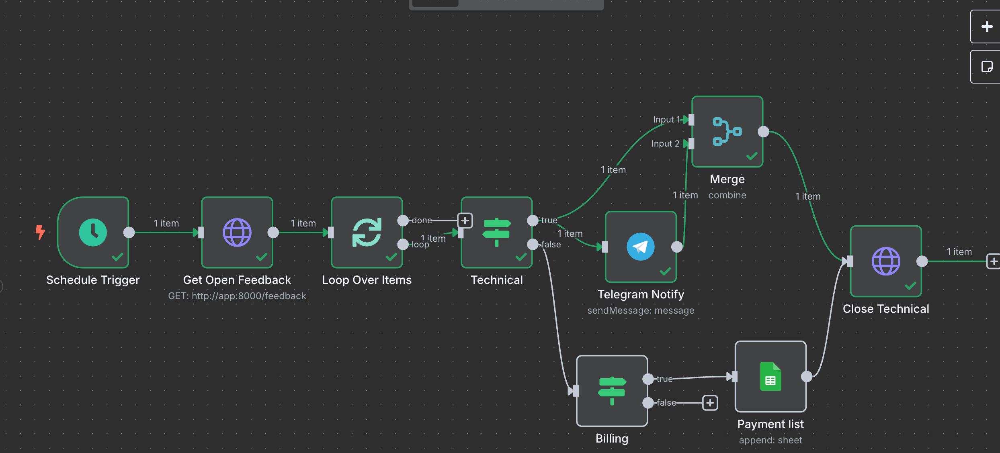

# FeedbackSystem


Сервис на FastAPI для приёма и обработки жалоб клиентов с интеграцией публичных API:
- Анализ тональности через APILayer
- Геолокация по IP через IP-API
- Классификация категории через OpenAI GPT-3.5 Turbo
- Хранение в SQLite
- Автоматизация в n8n: ежечасная проверка, уведомления в Telegram для «технических» жалоб, запись в Google Sheets для жалоб категории «оплата», автозакрытие.

## Запуск
1. Подготовить .env (пример в .env.example)
```
# .env
API_KEY=<ваш APILayer API key>  
API_GPT_KEY=<ваш OpenAI API key>
GPT_URL=<OpenAI API URL>
DATABASE_URL=sqlite+aiosqlite:///./database.db
N8N_USER=<логин для n8n>
N8N_PASSWORD=<пароль для n8n>
N8N_TELEGRAM_BOT=<токен бота>
N8N_GOOGLE_SHEETS_KEY=<ваш ключ сервис-аккаунта>
N8N_GOOGLE_SHEETS_SAE=<email сервис-аккаунта>
N8N_GOOGLE_SHEETS_ID=<id таблицы Google Sheets из URL>
```

2. Собрать и запустить контейнеры:
```
docker-compose up --build -d
```

## Возможности

### POST /feedback
Принимает JSON { "text": "..." }  
Получает и сохраняет:
- sentiment через APILayer (или "unknown" при ошибке)
- geolocation (страна, регион, город, широта/долгота) через IP-API
- category через OpenAI (техническая, оплата, другое; по умолчанию «другое»)
- cохраняет в SQLite с status="open" и меткой времени
Возвращает полный объект записи

### GET /feedback
Параметры запроса:  
- status (опционально, например open или closed)
- timestamp (опционально, UNIX-время в секундах)
- возвращает список подходящих записей

### POST /feedback/close/{feedback_id}
- помечает запись status="closed"
- возвращает обновлённый объект

### Workflow в n8n
- Schedule Trigger каждый час
- HTTP Request → GET /feedback?status=open&timestamp={{now-3600}}
- SplitInBatches → по одной жалобе за итерацию
- IF (category == "техническая") →
Telegram Notify → Close Technical (POST /feedback/close/{id})
- IF (category == "оплата") →
Google Sheets Append (дата, текст, тональность) → Close Billing

## Примеры запросов:

### POST /feedback
```
curl -X POST http://localhost:8000/feedback \
  -H 'Content-Type: application/json' \
  -d '{"text":"The app crashes when I upload a photo."}'
```
ответ:
```json
{
  "id": 1,
  "status": "open",
  "sentiment": "negative",
  "category": "техническая",
  "ip": "203.0.113.45",
  "country": "United States",
  "region": "California",
  "city": "Los Angeles",
  "latitude": 34.05,
  "longitude": -118.25
}
```

### GET /feedback
```
curl http://localhost:8000/feedback?status=open&timestamp=1752000000 \
    -H 'Content-Type: application/json' 
```
ответ:
```json
[
  {
    "id": 3,
    "text": "The app crashes every time I try to upload a photo.",
    "status": "open",
    "sentiment": "negative",
    "category": "техническая",
    "ip": "203.0.113.45",
    "country": "United States",
    "region": "California",
    "city": "Los Angeles",
    "latitude": 34.05,
    "longitude": -118.25
  },
  {
    "id": 4,
    "text": "I was charged twice for my last purchase.",
    "status": "open",
    "sentiment": "negative",
    "category": "оплата",
    "ip": "198.51.100.22",
    "country": "Canada",
    "region": "Ontario",
    "city": "Toronto",
    "latitude": 43.65,
    "longitude": -79.38
  }
]
```

### POST /feedback/close/{feedback_id}
```
curl -X POST http://localhost:8000/feedback/close/3 \
    -H 'Content-Type: application/json'
```
ответ:
```json
{
  "id": 3,
  "text": "The app crashes every time I try to upload a photo.",
  "status": "closed",
  "sentiment": "negative",
  "category": "техническая",
  "ip": "203.0.113.45",
  "country": "United States",
  "region": "California",
  "city": "Los Angeles",
  "latitude": 34.05,
  "longitude": -118.25
}
```
## Screenshots
### Workflow в n8n


